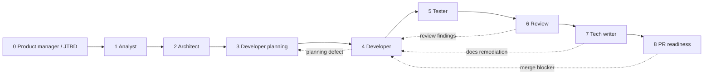
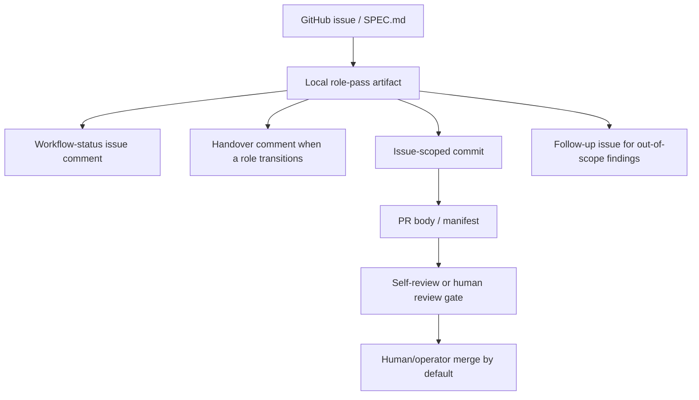

# Agent Workflow

This document defines the target operating model for this project's agentic development workflow.
`AGENTS.md` is the required first-read repository policy document; this document complements it by
making the workflow state machine, role-pass contract, branch strategy, and PR manifest rules
explicit and machine-checkable. If `AGENTS.md` is missing, stop before implementation or gate
decisions unless the active issue is specifically restoring that file.

## 1. Operating principles

- **Single-agent execution by default.** The normal path is one executor working end to end.
- **Multi-role, phase-driven delivery.** The single agent switches roles through formal passes.
- **Machine-checkable evidence.** Every pass records what it read, decided, and hands off.
- **Review-focused PRs.** Implementation PRs contain product/code/docs changes; generated workflow
  run files stay local so review remains focused.
- **GitHub-centric durable state.** Issues, workflow-status comments, PR bodies, commits, and
  closure metadata are the durable source of truth for delivery state.
- **Continue unless blocked.** Ordered child issues on a workstream continue automatically until a
  gate fails, scope changes, or human input is required.
- **JTBD for product management.** Product framing is grounded in the job-to-be-done.
- **Spec-driven analysis.** Analyst work refines the issue into testable acceptance criteria.
- **ADR-driven steering.** Architecture is constrained by the accepted ADR set.
- **Follow-up over drift.** Any out-of-scope finding becomes a follow-up issue, never a hidden TODO.

## 2. Decision context

The old rule — **one issue = one branch = one PR = one commit** — was deterministic, but too rigid
for related issue batches and autonomous delivery. The replacement is not a return to the old
multi-agent choreography. Instead, this project uses a **single-agent**, **multi-role** workflow with
explicit state, explicit artifacts, and explicit handoffs.

Multi-agent delegation remains optional support for broad discovery, advisory review, routed role
ownership, or offline parallel work. It is not the default implementation model. When a project
configures role routing, resolve the next role with `scripts/resolve-role-route.mjs`; missing
routing config keeps execution with the current single agent.

## 3. Workflow phases

The orchestrator is a state machine. Each issue declares which phases apply and may skip only when
that skip is recorded with a reason.

| Phase | Role                   | Purpose                                                  | Required output |
| ----- | ---------------------- | -------------------------------------------------------- | --------------- |
| 0     | Product manager / JTBD | Optional feature framing and decomposition               | role-pass       |
| 1     | Analyst                | Refine issue into testable acceptance criteria           | role-pass       |
| 2     | Architect              | Select workflow profile and implementation approach      | role-pass       |
| 3     | Developer planning     | Confirm files, tests, docs, branch/PR expectations       | role-pass       |
| 4     | Developer              | Implement the agreed change                              | role-pass       |
| 5     | Tester                 | Execute verification and record evidence                 | role-pass       |
| 6     | Review                 | Self-review for bounded/standard or request human review | role-pass       |
| 7     | Tech writer            | Confirm technical/user docs and screenshot decisions     | role-pass       |
| 8     | PR readiness           | Confirm merge contract and closeout state                | role-pass       |

`qa-expert` is an optional exploratory QA sidecar role, not a numbered phase in the deterministic sequence. Use it when exploratory/manual testing can add value beyond Phase 5 `tester` evidence. See [`docs/agents/qa-expert.md`](agents/qa-expert.md).

### Allowed transitions

- `0 -> 1 -> 2 -> 3 -> 4 -> 5 -> 6 -> 7 -> 8`
- `1 -> 2 -> 3 -> 4 -> 5 -> 6 -> 7 -> 8` for chores/bugs that do not need JTBD framing
- `4 -> 3` only when implementation reveals a planning defect
- `6 -> 4` only when review returns findings
- `7 -> 4` only when documentation changes require remediation
- `8 -> 4` only when PR-readiness finds a merge blocker

Any other transition is a workflow defect and must be logged in the workflow artifact.

### Phase diagram

This diagram illustrates the allowed state machine. The table and transition bullets above remain the authoritative contract.



### Execution and evidence flow



The default path is still single-agent execution. Optional multi-agent routing only changes who owns a role; it does not remove the role-pass, workflow-status, handover, PR, or follow-up evidence requirements.

## 4. Role-pass contract

Every pass must answer the same questions:

1. **What did I read?**
2. **What did I decide?**
3. **What remains uncertain?**
4. **What must the next role do?**

Each pass uses `agents/templates/role-pass.md`.

### Required fields

- Issue number and title
- Branch name
- Phase number and role
- Workflow profile
- Planned owner: the `roleAlternationPlan` owner for this role (`routing.roles.<role>.owner`), or
  `not-applicable:single-agent` when no routing config assigns this role — see §4a
- Actual executor identity (`human | claude | codex | agy | pi`)
- Launcher: the agent/runtime that initiated this pass (`human | claude | codex | agy | pi`); equal
  to the actual executor identity in single-agent execution
- Executor: the resolved `executionTarget` that actually ran this pass (for example `claude-cli`,
  `anthropic-api`, `agy-cli`, `agy-session`, `pi-parent`, `pi-subagent`, `pi-session`,
  `pi-subagent-model`, `codex-cli`, `provider-api`, or `human`) — see `docs/execution-targets.md`
- Transport: how the executor was reached (`local-cli | provider-api | pi-subagent |
intercom-session | orchestrated-worktree | manual`)
- Delegation boundary: where the work happened relative to the launcher (`current-session |
child-subagent | separate-local-session | child-worktree | human-handoff`)
- Context boundary: derived from transport + delegation boundary (`current-session |
fresh-session | forked-context | local-cli-child-process | provider-api-call | human-handoff |
worktree | intercom-session`) — see §4a
- Independence boundary: `independent | self-review | not-applicable`; required for the review
  role — see §4a
- Model / runtime when known (the actual model identifier, distinct from the execution target)
- Inputs read
- Decisions / findings
- Open questions or `none`
- Next-phase contract
- Status: `pass | blocked | returned | skipped`
- Signed-by and timestamp

Record launcher, executor, transport, delegation boundary, and model as distinct fields — do not
collapse them into "Actual executor identity" or "Model / runtime" alone. A bare agent-brand mention
(`claude`, `agy`, `pi`) is not an execution target: resolve it with
`node scripts/resolve-execution-target.mjs` (see `docs/execution-targets.md`) before recording it as
the executor, and never report a provider-API model call (`model: anthropic/claude-*` or any
`<brand>/<model>` identifier) as if the matching brand's local CLI ran.

### Provenance

- `<agent>` is the AI identity actually executing this pass right now (`claude`, `codex`, `agy`,
  `pi`, or `human`). Never copy `<agent>` from a prior pass, another issue, or a template example — record
  whichever agent is producing this specific pass.
- `<role>` is the phase/role being performed (`analyst`, `architect`, ..., `orchestrator`) and is
  independent of `<agent>`. The same agent performs every role in-session, but the signature still
  names both separately.
- The workflow-status comment's `**Implemented by:**` field must match the `<agent>` of the latest
  role-pass signature, or `human` when a human performed the latest pass.
- Ambiguous requests such as `with claude`, `with agy`, or `with pi` must resolve to an explicit
  `executionTarget` from project config (`routing.agents.<slug>.defaultExecutionTarget`) or a
  clarifying question before any work launches — never by silently inheriting the launcher's current
  model or provider. See `docs/execution-targets.md`.

## 4a. Role alternation and attribution (multi-agent mode)

`docs/execution-targets.md` (issue #54) makes launcher/executor/transport/delegation boundary
deterministic for a single pass. This section answers the question that provenance alone does not:
when a run claims multi-agent contribution, did the SDLC roles actually alternate across
independent intelligences, and is that alternation evidenced — not collapsed into one
`Implemented by` field?

### Concepts

- **`roleAlternationPlan`** — the planned role-to-agent assignment recorded before implementation
  starts. This is `routing.roles` in `agent-workflow.config.json` (see
  [`project-config.md`](project-config.md)) — not a new field, just the name for that existing plan
  when a run is evaluated for role alternation.
- **`roleIntelligence`** — the actual intelligence source that executed a role. This reuses the
  resolved `executionTarget` from `docs/execution-targets.md` (for example `claude-cli`, `agy-cli`,
  `pi-parent`, `human`) rather than introducing a second identity field.
- **`contextBoundary`** — a human-readable label for where a role ran: `current-session`,
  `fresh-session`, `forked-context`, `local-cli-child-process`, `provider-api-call`,
  `human-handoff`, `worktree`, or `intercom-session`. Derived from `transport` +
  `delegationBoundary` (`lib/role-attribution.mjs#deriveContextBoundary`) — never recorded as an
  independent fact that could disagree with those two `docs/execution-targets.md` fields.
- **`independenceBoundary`** — whether a role was cognitively independent from another role,
  especially developer vs. reviewer: `independent`, `self-review`, or `not-applicable`.
- **`roleAttributionMatrix`** — the durable evidence table mapping phase, role, planned owner,
  actual agent, executor, context boundary, independence boundary, and status. Required in the
  workflow-status comment and PR manifest whenever a run's `Mode` is `multi-agent`; never required
  for single-agent runs. In a multi-agent matrix, `Planned owner` must be an agent slug (`pi`,
  `claude`, `codex`, `agy`, or `human`). If a role has no `routing.roles.<role>` entry but is still
  included in a multi-agent run, record the planned owner as the agent intentionally assigned by the
  pre-execution roleAlternationPlan, usually the current orchestrator for that phase. Do not use
  `not-applicable:single-agent` inside a multi-agent matrix. See `agents/templates/pr-manifest.md`
  and `agents/templates/workflow-status-comment.md`.
- **`multiAgentClaim`** — any workflow evidence asserting multi-agent mode, tracked with the
  `Mode: single-agent | multi-agent` field in the workflow-status comment and the PR manifest's
  `## Agent review` section.
- **`selfReviewDisclosure`** — the explicit rationale recorded in `## Agent review`
  (`Self-review disclosure:`) when the developer and review rows in the matrix share the same
  `roleIntelligence`.

### Deterministic requirements when `multiAgentClaim` is true

1. Record a `roleAlternationPlan` (`routing.roles`) before implementation starts.
2. Every executed phase's role-pass records both `Planned owner` and the actual `roleIntelligence`.
3. Developer and review rows must use different `roleIntelligence` values, unless the review row's
   independence boundary is `self-review` and `Self-review disclosure` carries a rationale.
   `high-assurance` workflow profile forbids self-review outright, disclosed or not.
4. Tester/validation evidence names the agent that selected and ran checks (`Executed by` on the
   tester role-pass).
5. PR readiness cites the complete `roleAttributionMatrix`.
6. Handover comments annotate the planned owner, actual owner, context boundary, and independence
   boundary for the transition — not only the top-level launcher/executor. See
   `agents/templates/handover-comment.md`.
7. When routing falls back to a different agent, the matrix records both the planned owner and the
   actual owner; a row with a blank or non-agent planned owner cannot prove a fallback occurred correctly.
8. A skipped role records `status: skipped` with a reason.
9. A `multiAgentClaim` requires at least two distinct `roleIntelligence` values across the matrix —
   otherwise the run has degraded to single-agent and `Mode` must say so.

Single-agent runs (`Mode: single-agent`) never require a `roleAttributionMatrix` — role alternation
is optional value, never an artificial ritual forced onto a single executor.

### Validation

`scripts/validate-pr-manifest.mjs` enforces the requirements above whenever a PR manifest's `Mode`
is `multi-agent`, and always passes single-agent manifests through unchanged.
`scripts/validate-role-attribution.mjs` runs the same check against any markdown evidence surface
(for example a workflow-status comment export) that is not a PR manifest. Both share
`lib/role-attribution.mjs`, which is the source of truth if this document and the code ever
disagree; it deliberately reuses `lib/execution-targets.mjs` and `lib/role-routing.mjs` rather than
duplicating their fields.

## 5. Workflow evidence and local artifacts

Per issue, agents may keep local generated records under:

```text
.agent-runs/issues/<issue-number>/
  workflow.md
  pr-manifest.md
  passes/
    01-analyst.md
    02-architect.md
    03-developer-plan.md
    04-developer.md
    05-tester.md
    06-review.md
    07-techwriter.md
    08-pr-readiness.md
```

These files are **local execution artifacts**. They are gitignored and must not be committed in
normal implementation PRs. Their purpose is to help the active agent preserve context and produce
summaries.

Durable workflow evidence lives in GitHub:

- one signed workflow-status issue comment per addressed issue,
- orchestrator-owned ticket handover comments for every role transition, in both single-agent and
  multi-agent workflows,
- the PR body's workflow evidence section,
- validation output summarized in the PR body/comment,
- follow-up issues for deferred work.

Rules:

- `workflow.md` is the local running ledger.
- `passes/` contains local role-pass notes for completed phases.
- `pr-manifest.md` is a local draft/source for the PR body.
- Before PR creation, summarize role-pass evidence into the issue workflow-status comment and PR body.
- Use `agents/templates/handover-comment.md` for required ticket handover comments; do not include
  secrets, credentials, private prompts, or unrelated local machine details.
- The orchestrator owns handover comment compliance. A managed issue comment/thread is preferred to
  reduce noise, but the issue timeline must contain durable evidence for each role-to-role handover.
- Temporary scratch stays in `.agent-runs/scratch/`.

### Post-merge closeout

Complete every required role-pass phase for an issue — including a terminal `blocked` phase-6
status recording that high-assurance work awaits PR-stage human review — inside the same PR that
implements the issue, before that PR merges. Once the PR merges and GitHub closes the issue, do not
open a new commit or PR whose only purpose is to update workflow bookkeeping for that now-closed
issue. Record final completion via a signed edit to the issue's workflow-status comment only (see
`AGENTS.md` §15) — a comment edit, not a repository commit. Local `.agent-runs/` ledgers may be
updated for active-agent continuity, but they are never a requirement or a justification for opening
a new PR on their own.

Post-merge verification is explicit evidence, not an assumption. Record:

- merged PR number/URL
- merge commit
- closure result for every implemented issue
- closure result for the Epic too, when the PR intentionally included `Closes #<epic>`

## 6. Branch strategy

### Target model

The framework default supports a three-tier protected promotion path:

```text
main <- staging <- development <- feature/work branches
```

This repository overrides that default in `agent-workflow.config.json` because it uses `development`
as the integration branch and does not use a `staging` branch:

```text
main <- development <- feature/work branches
```

Implementation edits must happen on a bounded feature/work branch by default, never directly on
protected branches such as `development` or `main`. Projects may redefine branch names, optional
release-candidate usage, PR targets, and allowed work prefixes in `agent-workflow.config.json`; see
`docs/project-config.md`.

Default short-lived work branches include:

- `work/<theme>`
- `feature/<theme>`
- `fix/<theme>`
- `hotfix/<theme>`
- `spike/<theme>`

Examples:

- `work/customer-registry`
- `feature/customer-import`
- `fix/tenant-guard-regression`
- `hotfix/tenant-guard-regression`
- `spike/route-optimization-research`

### Rules

- One coherent theme per branch
- Multiple related issues are allowed on the same branch
- Each commit must map to one issue
- One PR may close multiple related issues
- The PR must include a manifest and explicit `Closes #<issue>` lines
- Ordered child issues on the same workstream proceed in sequence without waiting for re-confirmation between children unless blocked
- A spike branch is never merged directly; promote the learning into a new `work/<theme>` issue

### Migration note

Phase 1 documented the target model.
Phase 2 updated hooks, scripts, and enforcement to allow the target workstream branches.
Existing branch patterns (`issue/*`, `wt/*`, `claude/*`) remain valid compatibility branches during
migration, but new work should prefer `work/<theme>` unless a branch is already in progress.

## 7. Commit and PR rules

### Issue-scoped commits and default PR creation

Each commit must map to one issue, even on a shared workstream branch.
Recommended footer:

```text
Refs: #497
Role-Pass: developer
```

An orchestration call defaults to ending with committed work, a pushed branch, and an opened pull
request. For one issue, the terminal sequence is: complete required phases, run validation, update
workflow-status and handover comments, commit issue-scoped work, push the branch, open the PR, then
verify the PR in GitHub. For multiple issue IDs in one orchestration request, process the IDs in
order and defer the final PR until the last requested issue is complete; include one `Implements #...`
line per implemented issue when the PR targets the integration branch, or `Closes #...` only when
it targets the repository default/trunk branch and should rely on GitHub native auto-close semantics.

Merging is separate from PR creation. By default, the human/operator merges the PR. The orchestrator
must not merge unless explicitly instructed to do so. When auto-merge is explicitly requested, use
this default command to minimize variation:

```bash
gh pr merge --squash --delete-branch --auto
```

### PR manifest

Every PR must include:

- implemented issues (`Implements #...` for integration PRs, `Closes #...` for trunk/default-branch PRs)
- related issues (`Refs #...`)
- workflow evidence summary from the issue workflow-status comment
- CI-equivalent validation status (`passed`, `not-run-with-reason`, or `expected-fail-with-follow-up`)
- a `## Role attribution matrix` when `## Agent review`'s `Mode` is `multi-agent` — see §4a
- agent review fields under `## Agent review`, including `Mode` (`single-agent | multi-agent`) and,
  when developer/review share a `roleIntelligence`, `Self-review disclosure`
- follow-up issues created during implementation

The PR body should mirror this structure explicitly: one `Implements #<issue>` line per implemented
issue when merging to the configured integration branch, `Closes #<issue>` only when merging to the
repository default/trunk branch, `Refs #<issue>` for non-closing references, the actual implementing
agent, and the model / runtime used when known. Plain issue mentions are not sufficient for either
GitHub auto-closure or integration lifecycle automation.

If a PR implements the final remaining open child issues of an Epic, the PR body must also include
`Closes #<epic>` after the child closure lines. Do not add the Epic close line early while any child
issue is still open or intentionally deferred.

PR readiness is incomplete until the created PR is verified directly in GitHub for:

- PR number/URL
- target branch
- final body content
- required issue reference lines (`Implements` / `Closes` / `Refs`) for every implemented issue
- required workflow-status and handover evidence links
- required `## Agent review` fields
- GitHub check status
- merge mode: `human/operator` by default, or explicit auto-merge command recorded when requested

If any required GitHub check is expected to fail, the workflow-status comment must not claim `ready`.
Use a draft PR or a blocked/expected-fail state with concrete follow-up issues instead.

Use `agents/templates/pr-manifest.md` as a local draft template; copy the final manifest content into the PR body rather than committing the draft file.

### Development integration lifecycle

For projects with a separate integration branch, implementation issues close when the work is merged
to that integration branch. This keeps the open issue list focused on work that is not yet
integrated. Promotion from integration to trunk/main is tracked by a separate promotion issue or PR.

The installed `.github/workflows/integration-lifecycle.yml` runs on merged PRs and delegates to
`scripts/integration-lifecycle.mjs`. By default it processes PRs merged into `development`, parses
implementation/closure lines such as `Implements #...` and `Closes #...` from the PR body, comments
on linked issues with integration evidence, adds configured labels such as `integrated:development`
and `awaiting-release`, and closes the implementation issues. Related references such as
`Refs #...` are intentionally ignored by lifecycle automation. Required GitHub token permissions are
`contents: read`,
`pull-requests: read`, and `issues: write`.

### Release versioning and promotion evidence

Release promotion from the integration branch to trunk/main uses the project's configured release
versioning strategy. The default is `main.minor.fix`:

- `main`: breaking or compatibility-impacting releases;
- `minor`: additive backwards-compatible capabilities;
- `fix`: backwards-compatible corrections and clarifications.

Release PRs or release manifests must record the intended version/tag, bump type, rationale,
included integrated issues, excluded/deferred issues, validation commands, release notes path, and
operator approval before tags or GitHub Releases are pushed. Use `node bin/cli.mjs release-plan` for
a read-only preview and `node scripts/validate-release-versioning.mjs` for consistency checks. See
[`docs/release-versioning.md`](release-versioning.md).

### Role routing and handover comments

A project may define role routing in `agent-workflow.config.json`; see `docs/project-config.md` and
`docs/agent-routing.md`. Supported agent slugs are `agy`, `codex`, `claude`, and `pi`.

Before starting a routed phase, resolve the role:

```bash
node scripts/resolve-role-route.mjs --role <role> --current <agy|codex|claude|pi> --json
```

If the selected agent is the current executor, continue as single-agent execution, but still record
the phase-to-phase handover in the issue. If the selected agent differs, or if the configured owner
falls back to another agent, include the routing/fallback details in that handover evidence.
Handover comments are also required when a role returns work to an earlier phase, a human
review/decision is requested, or a session ends before the next role can continue. Use the selected
agent's `callWorkflowDoc` to avoid on-the-fly discovery.

The preferred model is one orchestrator-managed handover thread per issue, marked with
`<!-- agent-handover -->`, updated or appended as phases complete. A comment-per-handover model is
also valid when a project wants a fully chronological issue timeline.

PR readiness must cite the required handover comment/thread URL, or document an explicit exception
when no role transition occurred.

## 8. Review model

- **Bounded**: self-review allowed
- **Standard**: self-review allowed, but it must be explicit and evidence-backed
- **High-assurance**: human security and acceptance review required. This review happens on the
  open PR before merge — implementation commits, pushes, and PR creation are never blocked on it.
  Only the merge and the phase-6 gate sign-off wait for the human reviewer on the now-open PR
  (`for-review:human`). Self-review is forbidden outright at this profile, even with a
  `selfReviewDisclosure` — see §4a.

Review roles are read-only by default. If a review finds a defect, it returns the work to the
implementation phase instead of patching code inside the review pass.

When a run's `Mode` is `multi-agent`, the review role's `independenceBoundary` must be
`independent` from the developer role unless self-review is explicitly disclosed (§4a). A
single-agent run is exempt — the same executor performing every role is the expected shape, not a
disclosed exception.

Merged-PR closeout should happen in GitHub issue comments, PR metadata, and session evidence. Do not create new
tracked repository changes on already-closed issues solely to update workflow bookkeeping.

## 9. QA vs Automation Lifecycle

The QA process relies on a two-way collaboration between the deterministic `tester` role and the exploratory `qa-expert` role to eliminate rework and maximize coverage.

### Lifecycle Flow

1. **Implementation (Phase 4)**: The developer implements the feature.
2. **Deterministic Testing (Phase 5)**: The `tester` validates the specific Acceptance Criteria using Playwright and Vitest (the "Happy Path" and known edge cases). This creates the deterministic coverage baseline.
3. **Exploratory QA (Phase X)**: The `qa-expert` role takes over to run exploratory sessions using Vibium. The agent skips paths already covered in Phase 5 and focuses exclusively on negative paths, system quirks, and boundaries.
4. **Refinement**: Bugs found by `qa-expert` are converted to Level 1 child issues and fixed by a developer.
5. **Regression Automation (Phase 5)**: Fixed bugs are graduated by the `tester` into deterministic Playwright/Vitest tests. The `tester` uses the exploratory findings to harden the locators and timings of the entire test suite.

## 10. Epic workstreams and validation/docs closeout

### Epic child loop

For an Epic implemented on one workstream branch, run the session-start loop per child issue:

1. export that child to `SPEC.md`
2. validate `SPEC.md`
3. initialize/update local `.agent-runs/issues/<child>/...` notes when useful
4. execute the required phases for that child
5. commit/push the child issue work
6. advance directly to the next declared child issue unless blocked

### Validation/docs closeout child

When a child issue exists primarily to validate and document previously implemented work:

- prefer extending existing tests/assets over creating standalone screenshot-only files
- update screenshot manifests and matching MDX placeholders together
- record local E2E environment blockers explicitly when app/auth setup is missing
- do not stall the workstream when registration/manifest/docs verification still provides valid evidence

## 11. Follow-up handling

Use a follow-up issue whenever:

- a useful improvement is out of scope
- a review finds non-blocking work
- branch cleanup or operational hygiene needs later automation
- product, spec, or architecture decisions must be revisited separately

Do not leave TODO comments or silent omissions.

## 12. Phase 1 vs Phase 2 split

### Phase 1 — documentation and process

- Update `AGENTS.md`, role adapters, workflow skills, and templates
- Define the target branch strategy, state machine, and role-pass format
- Document migration from current issue branches to workstream branches

### Phase 2 — automation and enforcement

- Generate local workflow notes automatically (`scripts/ensure-workflow-artifacts.mjs`)
- Validate phase transitions where practical
- Update hooks to enforce the new branch strategy
- Validate PR manifests (`scripts/validate-pr-manifest.mjs`)
- Add merged-branch follow-up cleanup automation or deterministic guidance (`scripts/branch-cleanup-report.mjs`)
